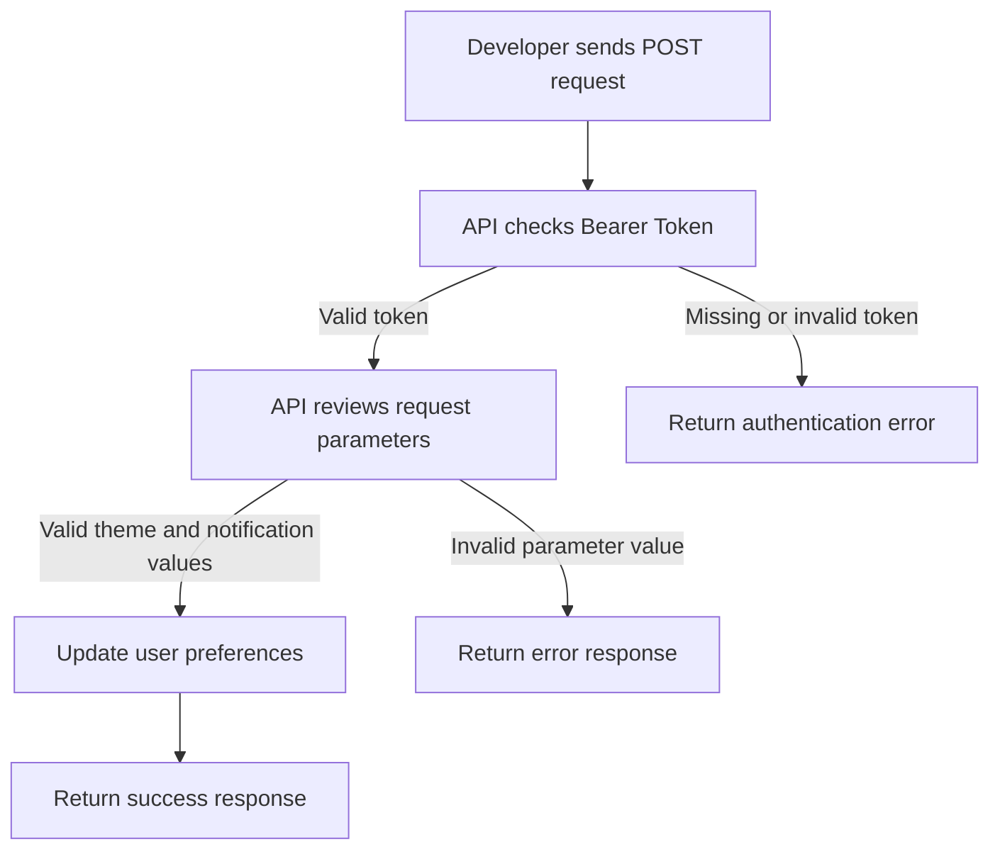

# User Profile API v2 Reference

## API Overview

The User Profile API v2 allows developers to update a user's profile preferences. This endpoint can be used to save a user's theme setting and notification preference.

Use this endpoint when a user changes their display theme or turns notifications on or off in their profile settings.

**Endpoint:** `POST /api/v2/users/preferences`

## Authentication

This API requires a Bearer Token for authentication.

Include the token in the request header:

```bash
Authorization: Bearer YOUR_TOKEN_HERE
```

If the request does not include a valid Bearer Token, the API will reject the request.

## Request Details

Send a `POST` request to the following endpoint:

```bash
POST /api/v2/users/preferences
```

### Request Parameters

| Parameter | Type | Required | Description | Accepted Values |
| --- | --- | --- | --- | --- |
| `theme` | string | Yes | Sets the user's display theme. | `light`, `dark`, `system` |
| `notifications_enabled` | boolean | Yes | Turns user notifications on or off. | `true`, `false` |

## Success Request Example

The following example shows a valid request body:

```json
{
  "theme": "dark",
  "notifications_enabled": true
}
```

## Success Response Example

The following example shows a successful response after the user's preferences are updated:

```json
{
  "status": "success",
  "message": "User preferences updated successfully."
}
```

## Error Response Example

The API returns an error if the request includes an invalid theme value.

```json
{
  "status": "error",
  "message": "Invalid theme selected."
}
```

## API Request Flow

The following Mermaid diagram shows how the API checks the request before returning a success or error response.



## Notes for Developers

Use only the accepted values for the `theme` parameter. The API accepts `light`, `dark`, or `system`.

The `notifications_enabled` parameter must use a boolean value. Use `true` to enable notifications and `false` to disable them.