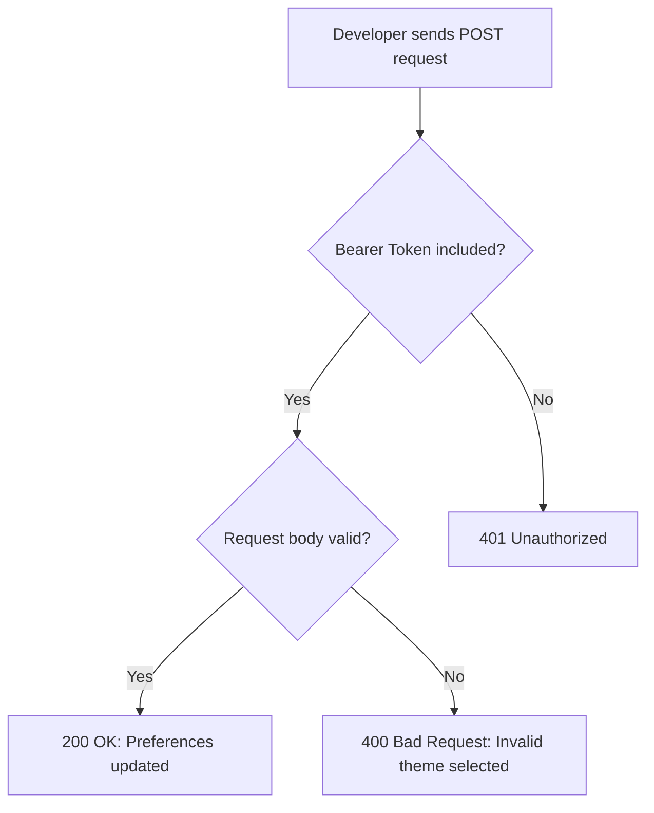

# API Reference

## API Overview

The Acme Corp API v2 allows developers to update user profile preferences through a secure endpoint. This includes features such as theme selection and notification settings.

This API follows REST principles and uses JSON for both requests and responses.

---

## Authentication

This endpoint requires Bearer Token authentication. Include your token in the `Authorization` header for every request.

### Example

```http
Authorization: Bearer YOUR_API_TOKEN
```

Requests without a valid Bearer Token return a `401 Unauthorized` response.

## Endpoint

**POST** `/api/v2/users/preferences`

## Request Body Parameters

| Parameter | Type | Required | Description |
|---|---|---|---|
| `theme` | string | Yes | Sets the user's display theme. Accepted values are `"light"`, `"dark"`, or `"system"`. If a user enters `"High-Contrast"`, the API returns an error because it is not an accepted value. |
| `notifications_enabled` | boolean | Yes | Turns notifications on or off. Use `true` to enable notifications or `false` to disable them. |

## Example POST Request

```json
{
  "theme": "dark",
  "notifications_enabled": true
}
```

## Success Response

If the request is valid, the API returns a `200 OK` response.

```json
{
  "status": "updated",
  "timestamp": "2026-05-20T10:00:00Z"
}
```

## Error Responses

If the Bearer Token is missing or invalid, the API returns a `401 Unauthorized` response.

```json
{
  "error": "Unauthorized",
  "message": "Missing or invalid Bearer Token."
}
```

If the `theme` value is invalid, such as `"High-Contrast"`, the API returns a `400 Bad Request` response.

```json
{
  "error": "Invalid theme selected."
}
```

## API Flow Diagram

This diagram shows how the API responds when a developer sends a request with or without a valid Bearer Token.


