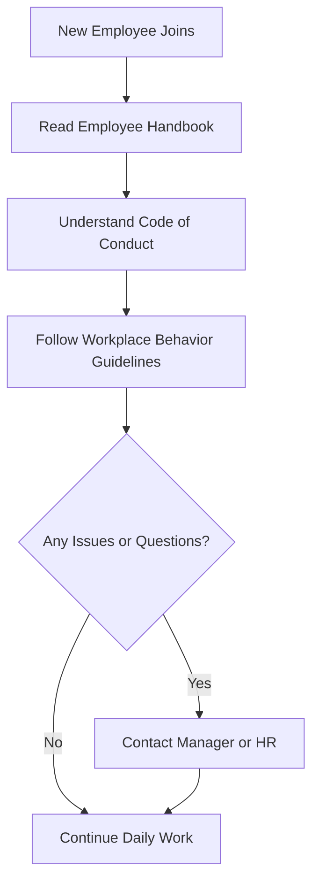

# Employee Handbook

Welcome to the team! This handbook introduces employees to company policies, workplace expectations, and available resources.
The diagram below shows the basic onboarding and workplace expectations.

## Onboarding Process

This diagram shows the steps a new employee follows, from joining the company to completing onboarding tasks and continuing daily work.

This process helps employees understand expectations and where to go for support.

## Code of Conduct
This section explains how employees are expected to behave in the workplace.

Employees must treat coworkers, clients, and partners with respect. Harassment, discrimination, or unsafe behavior will not be tolerated.

## Workplace Behavior
This section outlines daily expectations for employee behavior and communication.

Employees are expected to:

- Arrive on time for scheduled work hours
- Communicate professionally with team members
- Follow workplace policies and company guidelines

## Office Guidelines
This section provides general rules for maintaining shared workspaces.

Employees should keep shared workspaces clean and organized. Be respectful of others when using shared equipment or common areas.
